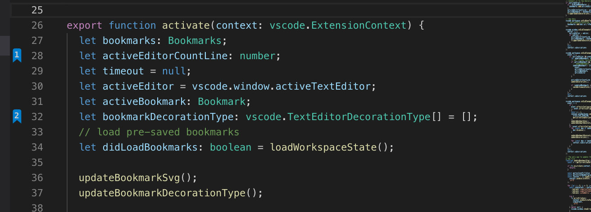

# Numbered Bookmarks

It helps you to navigate through your code, moving between important positions easily and quickly.

# Features

You can customize bookmark number and background colors.

## Available commands

* `Numbered Bookmarks: Toggle Bookmark _'number'_` Mark/unmark the current line with a numbered bookmark
* `Numbered Bookmarks: Jump to Bookmark _'number'_` Move the cursor to the numbered bookmark
* `Numbered Bookmarks: List` List all bookmarks from the current file
* `Numbered Bookmarks: List from All Files` List all bookmarks from the all files
* `Numbered Bookmarks: Clear` remove all bookmarks from the current file
* `Numbered Bookmarks: Clear from All Files` remove all bookmarks from the all files

> Both **Toggle** and **Jump to Bookmark** commands are numbered from 0 to 9

## Manage your bookmarks

You can easily mark/unmark bookmarks in any line and jump between them.



## Available Settings

* Bookmarks are always saved between sessions, and you can decide if it should be saved _in the Project_, so you can add it to your Git/SVN repo and have it in all your machines _(`false` by default)_. Set to `true` and it will save the bookmarks in `.vscode\numbered-bookmarks.json` file.
```json
    "numberedBookmarks.saveBookmarksInProject": true
```

* You can change the background color of a bookmark using color names `blue`, RGB `rgb(0, 255, 37)` or HEX `#00ff25` format.

```json
    "numberedBookmarks.gutterIconFillColor"
```

* It is also possible to change number color itself using the same color formats.

```json
    "numberedBookmarks.gutterIconNumberColor"
```

* Choose background color to use on a bookmarked line

```json
    "numberedBookmarks.backgroundLineColor"
```

## Project and Session Based

The bookmarks are saved _per session_ for the project that you are using. You don't have to worry about closing files in _Working Files_. When you reopen the file, the bookmarks are restored.

It also works even if you only _preview_ a file (simple click in TreeView). You can put bookmarks in any file and when you preview it again, the bookmarks will be there.

## Collaboration

Feel free to send a PR, feature request or report a bug on github https://github.com/vasilev-alex/vscode-numbered-bookmarks

# License

[MIT](LICENSE.md)